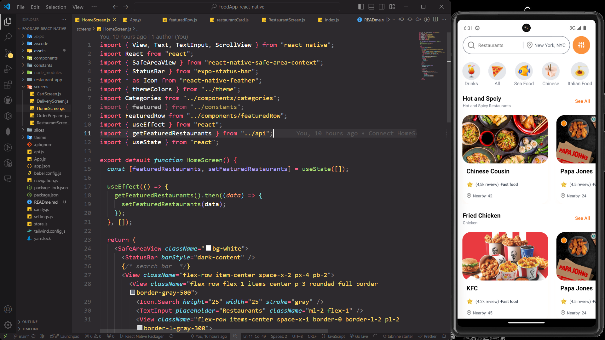
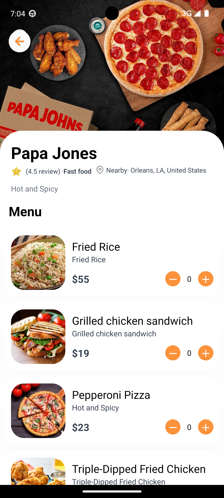
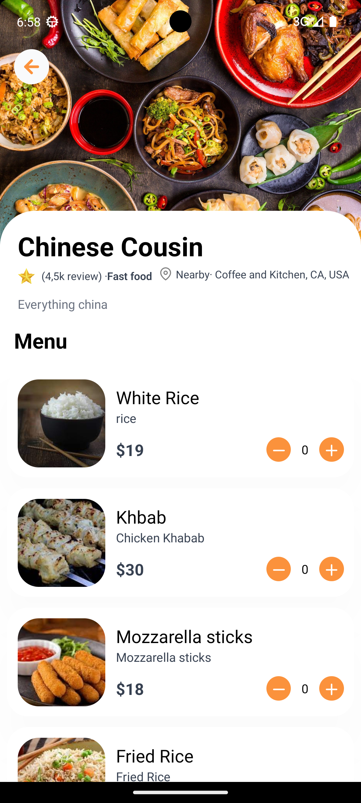
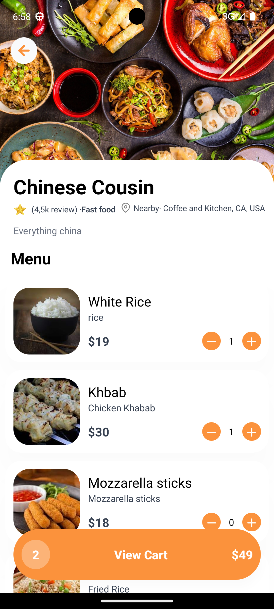
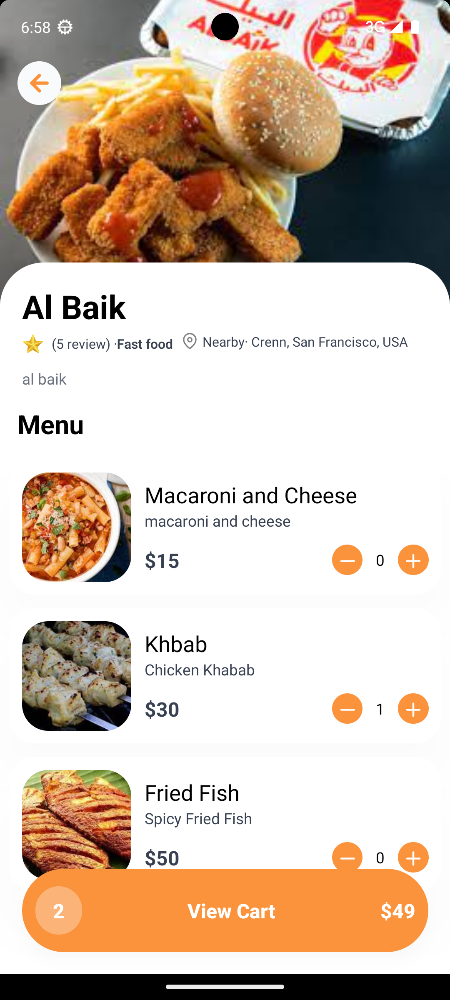
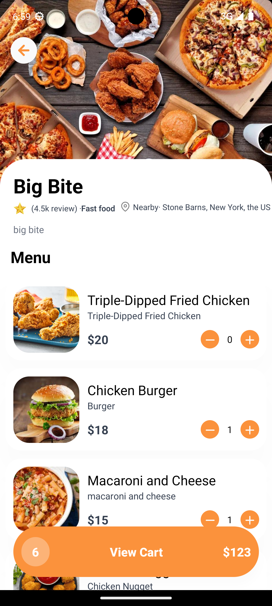
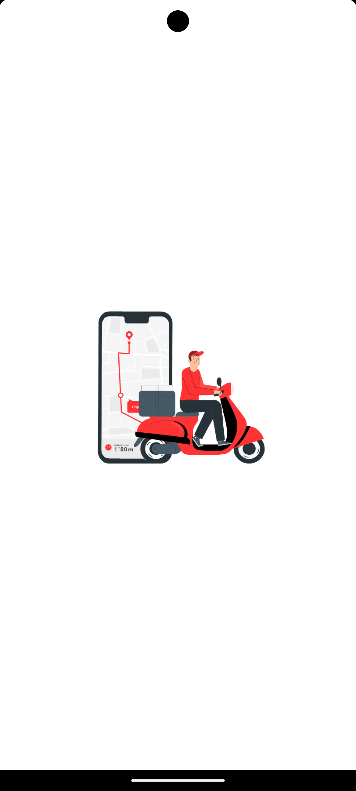
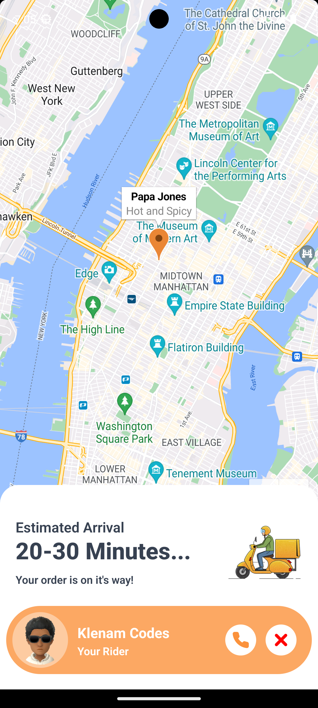

#

## FOOD APP

### Welcome to the Foodie Express app, a React Native project designed to streamline your food delivery experience. This app allows users to explore a curated selection of restaurants and their offerings based on food categories and preferences. With features for browsing menus, viewing dish details, calculating order costs including delivery fees, and tracking real-time delivery progress, Foodie Express aims to make ordering food both convenient and enjoyable. Dive into the repository to see how we’ve implemented these features and contribute to the ongoing development!

#

# SCREENSHOT OF APPLICATION

#

 **1**
 **2**
 **3**
 **4**
 **5**
 **6**
 **7**
 **8**
 **9**
